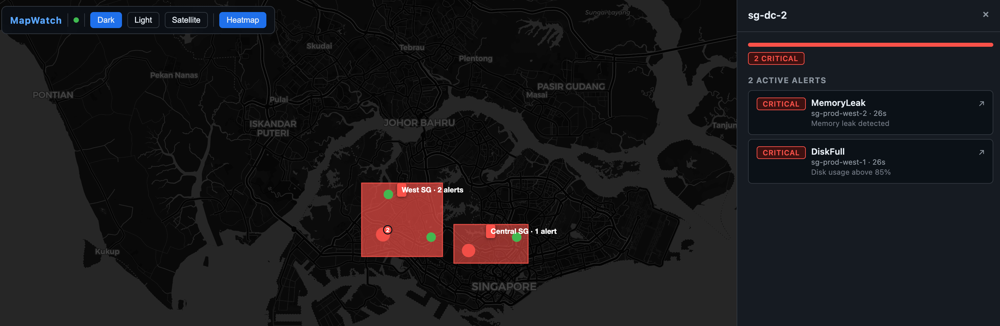

# MapWatch

**See where your alerts are firing — instantly, on a map.**

MapWatch is an open-source Prometheus Alertmanager receiver that turns firing alerts
into live, geo-located markers on a map. Add a `geohash` label to your alert rules,
point Alertmanager at MapWatch, and your infrastructure lights up on the map in real time.



```
  Prometheus ──fires──► Alertmanager ──webhook──► MapWatch ──WebSocket──► Browser
                                                    :8080                  (map)
```

**No dashboards to configure. No databases. One binary, one config file.**

---

## Features

- **Drop-in Alertmanager receiver** — add one `webhook_configs` entry; one dot per firing alert
- **Geohash geo-encoding** — place alerts on the map with a single label: `geohash: w21zd3`
- **DC baseline markers** — known datacenter locations from config appear as green "healthy" dots on load; turn red/yellow and blink when alerts fire for them
- **Multi-alert aggregation** — multiple alerts at the same DC are aggregated onto one dot with a count badge; click to see a sorted list with severity summary bar
- **Live updates via WebSocket** — dots appear, pulse, and disappear as alerts fire and resolve
- **Critical alerts blink** — `severity: critical` triggers a CSS pulse animation automatically
- **Click-to-Prometheus** — click any dot to open the matching PromQL query in Prometheus
- **Choropleth heatmap** — pre-defined geographic regions coloured by severity (like a US state map); toggle in toolbar
- **Single binary, zero deps** — static assets embedded via `go:embed`; runs anywhere Go runs

---

## Examples

Ready-to-run Docker Compose stacks that highlight specific features.
Each example lives in [`examples/`](examples/) and is fully self-contained.

| Example | Port | What it shows |
|---------|------|---------------|
| [blink-dot](examples/blink-dot/) | 8081 | 5 green DC dots; 2 turn red — one with 1 alert, one with 2 alerts (badge) |
| [heatmap](examples/heatmap/)     | 8082 | Singapore choropleth overlay — coloured region rectangles by severity |

```bash
# Blink-dot — 5 green DC dots on load; 2 turn red ~15s later
cd examples/blink-dot && docker compose up -d
# open http://localhost:8081

# Heatmap — alerts fire; click "Heatmap" in toolbar to see coloured region rectangles
cd examples/heatmap && docker compose up -d
# open http://localhost:8082  →  click the "Heatmap" toolbar button
```

See [`examples/README.md`](examples/README.md) for the full index.

---

## Try the demo in 3 minutes

The repo ships with always-firing demo alerts so you can see blinking markers immediately — no real infrastructure needed.

### Step 1 — Start the stack

```bash
git clone https://github.com/teochenglim/mapwatch.git
cd mapwatch
docker compose up --build
```

> `--build` rebuilds the MapWatch image from local source. Use `docker compose up -d` (no `--build`) if you just want to pull the published image.

This starts three services:

| Service      | URL                     |
|--------------|-------------------------|
| MapWatch     | http://localhost:8080   |
| Prometheus   | http://localhost:9090   |
| Alertmanager | http://localhost:9093   |

### Step 2 — Open the dashboard

Open **http://localhost:8080** in your browser.

You will see the demo unfold in two stages:

**Stage 1 — on page load (immediate):**

| Dot     | Location         | Colour | Meaning      |
|---------|------------------|--------|--------------|
| sg-dc-1 | Singapore CBD    | Green  | DC healthy   |
| sg-dc-2 | Singapore West   | Green  | DC healthy   |
| sg-dc-3 | Singapore North  | Green  | DC healthy   |
| sg-dc-4 | Singapore East   | Green  | DC healthy   |
| sg-dc-5 | Singapore Central| Green  | DC healthy   |

**Stage 2 — after ~15 seconds (when Alertmanager fires):**

| Dot     | Location       | Colour | Behaviour                        |
|---------|----------------|--------|----------------------------------|
| sg-dc-1 | Singapore CBD  | Red    | **Blinking** — 1 alert           |
| sg-dc-2 | Singapore West | Red    | **Blinking** — 2 alerts, badge ②  |
| sg-dc-3 | Singapore North| Green  | Still healthy (no alerts)        |
| sg-dc-4 | Singapore East | Green  | Still healthy (no alerts)        |
| sg-dc-5 | Singapore Central| Green| Still healthy (no alerts)        |

> Click **sg-dc-1** to see a single-alert detail panel.
> Click **sg-dc-2** to see the aggregated panel — severity bar, count chips, and a scrollable list of both alerts.

### Step 3 — Interact with a marker

**Hover** over a dot to see a tooltip with:
- Alert name and severity
- Instance and datacenter labels
- Summary annotation

**Click** a dot to open the side panel, then click any **"↗" Prometheus link** to open the live query in the Prometheus expression browser (http://localhost:9090).

### Step 4 — Send your own alert

Fire a custom blinking marker without Prometheus using `curl`:

```bash
curl -s -XPOST http://localhost:8080/api/markers \
  -H 'Content-Type: application/json' \
  -d '{
    "id":        "my-alert-1",
    "geohash":   "w21zd3",
    "severity":  "critical",
    "alertname": "MyTest",
    "labels": {
      "instance":   "my-server",
      "datacenter": "sg-dc-1"
    },
    "annotations": {
      "summary": "This dot will blink!"
    }
  }'
```

Open http://localhost:8080 — a blinking red dot appears at Singapore CBD immediately.

> Any marker with `"severity": "critical"` blinks via the CSS pulse animation.
> `"severity": "warning"` renders as a solid yellow dot; `"info"` as blue.

### Step 5 — Remove a marker

```bash
curl -s -XDELETE http://localhost:8080/api/markers/my-alert-1
```

The dot disappears from the map in real time across all open browser tabs.

### How the demo alerts work

The file `deploy/alerts.yml` contains three always-firing Prometheus rules across two groups:

```yaml
# group demo-cbd → 1 alert on sg-dc-1
- alert: HighCPU
  labels: { severity: critical, datacenter: sg-dc-1, instance: sg-prod-cbd-1 }

# group demo-west → 2 alerts on sg-dc-2
- alert: DiskFull
  labels: { severity: critical, datacenter: sg-dc-2, instance: sg-prod-west-1 }

- alert: MemoryLeak
  labels: { severity: critical, datacenter: sg-dc-2, instance: sg-prod-west-2 }
```

All three use `vector(1)` so they fire immediately.  Alertmanager sends one webhook per group
to `/api/alerts` — the two-group design means dc-1 and dc-2 fire independently without
overwriting each other.

Prometheus evaluates these every 15 s → fires to Alertmanager → Alertmanager POSTs to
`http://mapwatch:8080/api/alerts` → MapWatch decodes the geohash → WebSocket pushes
the marker to your browser.

---

## Quick start (Docker Compose — recommended)

### 1. Clone the repo

```bash
git clone https://github.com/teochenglim/mapwatch.git
cd mapwatch
```

### 2. Create a minimal config file

```bash
cat > mapwatch.yaml <<'EOF'
server:
  addr: ":8080"

prometheus:
  url: http://prometheus:9090
  timeout: 10s

# Map datacenter/region label values to geohash strings
locations:
  sg-dc-1: w21zd3
  sg-dc-2: w21z8k
  us-east-1: dr5reg
  us-west-2: 9q8yy
  eu-west-1: gc6uf

# PromQL templates shown when clicking a marker
query_templates:
  HighCPU:
    - label: "CPU Usage %"
      query: 'rate(node_cpu_seconds_total{mode="user",instance="{{.instance}}"}[5m]) * 100'
  default:
    - label: "CPU Usage %"
      query: 'rate(node_cpu_seconds_total{mode="user",instance="{{.instance}}"}[5m]) * 100'
EOF
```

### 3. Start the stack

```bash
# Build from local source (development):
docker compose up --build

# Or pull the published image (quickstart, no Go needed):
docker compose up -d
```

This starts:

| Service      | URL                     | Purpose                  |
|--------------|-------------------------|--------------------------|
| mapwatch     | http://localhost:8080   | Map dashboard            |
| Prometheus   | http://localhost:9090   | Metrics storage          |
| Alertmanager | http://localhost:9093   | Alert routing            |

Open **http://localhost:8080** in your browser.

---

## Quick start (binary)

### Prerequisites

- Go 1.23+

### 1. Install

```bash
# From source (binary lands in bin/mapwatch)
git clone https://github.com/teochenglim/mapwatch.git
cd mapwatch
make build

# Or with go install
go install github.com/teochenglim/mapwatch@latest
```

### 2. Run the server

```bash
./bin/mapwatch serve
# → listening on :8080
```

Pass a custom config:

```bash
./bin/mapwatch serve --config ./mapwatch.yaml
```

### 3. Override settings with environment variables

Every config key is available as `MAPWATCH_<KEY>`:

```bash
MAPWATCH_SERVER_ADDR=":9000" \
MAPWATCH_PROMETHEUS_URL="http://prom:9090" \
./mapwatch serve
```

---

## Docker images

Pre-built multi-arch images (linux/amd64, linux/arm64) are published to
GitHub Container Registry on every release tag.

```bash
# Pull latest
docker pull ghcr.io/teochenglim/mapwatch:latest

# Run standalone (no Prometheus/Alertmanager)
docker run -p 8080:8080 ghcr.io/teochenglim/mapwatch:latest

# Run with a config file
docker run -p 8080:8080 \
  -v $(pwd)/mapwatch.yaml:/mapwatch.yaml:ro \
  ghcr.io/teochenglim/mapwatch:latest
```

Available tags:

| Tag         | Description                        |
|-------------|------------------------------------|
| `latest`    | Latest stable release              |
| `v1.2.3`    | Specific version                   |
| `1.2`       | Latest patch of a minor series     |

---

## Alertmanager integration

### 1. Point Alertmanager at mapwatch

In your `alertmanager.yml`:

```yaml
receivers:
  - name: mapwatch
    webhook_configs:
      - url: http://mapwatch:8080/api/alerts
        send_resolved: true

route:
  receiver: mapwatch
```

### 2. Label your alert rules with geo info

**Option A — Geohash (preferred):**

```yaml
groups:
  - name: infra
    rules:
      - alert: HighCPU
        expr: avg by (instance) (rate(node_cpu_seconds_total{mode!="idle"}[5m])) > 0.9
        labels:
          severity: critical
          geohash: w21zd3      # Singapore
```

**Option B — datacenter label (resolved via `locations` in config):**

```yaml
        labels:
          severity: warning
          datacenter: sg-dc-1
```

**Option C — raw lat/lng:**

```yaml
        labels:
          severity: info
          lat: "1.3521"
          lng: "103.8198"
```

**Geo resolution priority** (first match wins):
1. `geohash` label
2. `lat` + `lng` labels
3. `datacenter` or `region` label → config lookup table
4. Alert skipped with a warning log (no crash)

---

## Prometheus on-click links

Click any marker to open the side panel.  Under **Prometheus Metrics** you will
see one button per configured `query_templates` entry.  Each button opens the
Prometheus expression browser in a new tab with the PromQL pre-filled.

The server renders the PromQL templates using Go `text/template` against the
alert's full label map, then returns ready-to-click URLs via
`GET /api/markers/:id/links`.

**Config example:**

```yaml
prometheus:
  url: http://prometheus:9090          # server → Prometheus (internal)
  external_url: http://localhost:9090  # browser → Prometheus (public URL)

query_templates:
  HighCPU:
    - label: "CPU Usage %"
      query: 'rate(node_cpu_seconds_total{mode="user",instance="{{.instance}}"}[5m]) * 100'
    - label: "Load Average"
      query: 'node_load1{instance="{{.instance}}"}'
  DiskFull:
    - label: "Disk Used %"
      query: '100 - (node_filesystem_free_bytes{instance="{{.instance}}"} / node_filesystem_size_bytes * 100)'
  default:                           # fallback for any alertname not listed above
    - label: "CPU Usage %"
      query: 'rate(node_cpu_seconds_total{mode="user",instance="{{.instance}}"}[5m]) * 100'
```

Template variables are the alert's **full label map** — use `{{.labelname}}` for any label.

> Set `prometheus.external_url` to the public hostname of your Prometheus if it
> differs from the URL the server uses internally (common in Docker / Kubernetes).

---

## CLI reference

```
mapwatch download              Download world GeoJSON from Natural Earth
mapwatch slice --region=SG     Clip GeoJSON to a region bounding box
mapwatch export                Export self-contained static HTML (no server)
mapwatch serve                 Start the HTTP server
```

### `mapwatch download`

```bash
mapwatch download --out ./data
# → ./data/world.geojson
```

### `mapwatch slice`

```bash
mapwatch slice --region=SG --src ./data/world.geojson --dst ./singapore.geojson
```

Supported region codes: `SG`, `US`, `EU`, `JP`, `AU`

### `mapwatch export`

```bash
mapwatch export --out snapshot.html
# Open snapshot.html — works fully offline, no server required.
```

---

## REST API

| Method | Path                          | Description                                     |
|--------|-------------------------------|-------------------------------------------------|
| GET    | `/api/config`                 | Runtime config (Prometheus URL + DC locations)  |
| GET    | `/api/markers`                | List all active markers                         |
| POST   | `/api/markers`                | Add / update a generic marker                   |
| DELETE | `/api/markers/:id`            | Remove a marker                                 |
| POST   | `/api/alerts`                 | Alertmanager webhook receiver                   |
| GET    | `/api/markers/:id/links`      | Rendered Prometheus expression-browser links    |
| GET    | `/api/markers/:id/details`    | Raw Prometheus time-series (for custom UIs)     |
| GET    | `/ws`                         | WebSocket — live marker events                  |

### Send a custom marker

```bash
curl -s -XPOST http://localhost:8080/api/markers \
  -H 'Content-Type: application/json' \
  -d '{
    "id": "my-marker-1",
    "geohash": "w21zd3",
    "severity": "warning",
    "alertname": "ManualTest",
    "labels": { "env": "prod" },
    "annotations": { "summary": "Test marker" }
  }'
```

### WebSocket event contract

```json
{ "type": "marker.add",    "marker": { "id": "...", "lat": 1.35, "lng": 103.8, ... } }
{ "type": "marker.update", "marker": { ... } }
{ "type": "marker.remove", "id": "fingerprint" }
```

On connect, the server replays all current markers as `marker.add` events
so page reloads and reconnections are fully synced.

---

## Effect plugin system

Register custom JS effects that run on every WebSocket event:

```js
// my-effect.js — include after mapwatch.js
MapWatch.registerEffect('my-custom-effect', function (event, map, markerMap) {
  if (event.type !== 'marker.add') return;
  const m = event.marker;
  // do something with m, map, markerMap...
});
```

Built-in effects (in `static/effects/`):

| Effect          | What it does                                                | Example |
|-----------------|-------------------------------------------------------------|---------|
| `blink-critical`| CSS pulse animation on `severity=critical` markers          | [examples/blink-dot](examples/blink-dot/) |
| `heatmap`       | Choropleth rectangle overlay coloured by severity (toggle via `MapWatch.toggleHeatmap()`) | [examples/heatmap](examples/heatmap/) |
| `geohash-grid`  | Draws the geohash bounding rectangle on marker hover        | — |

---

## Configuration reference

```yaml
server:
  addr: ":8080"                  # Listen address

prometheus:
  url: http://prometheus:9090    # Prometheus base URL
  timeout: 10s                   # Query timeout

spread:
  radius: 0.01                   # Degrees offset for co-located markers

locations:                       # datacenter/region → geohash lookup table
  sg-dc-1: w21zd3               #   • Shown as green "healthy" dots on map load
  us-east-1: dr5reg              #   • Alerts matching via `datacenter:` label aggregate onto the dot

query_templates:                 # alertname → PromQL templates
  HighCPU:
    - label: "CPU %"
      query: 'rate(node_cpu_seconds_total{instance="{{.instance}}"}[5m]) * 100'
  default:
    - label: "CPU %"
      query: 'rate(node_cpu_seconds_total{instance="{{.instance}}"}[5m]) * 100'
```

All keys can be overridden with environment variables using the `MAPWATCH_` prefix
and `_` as separator (e.g. `MAPWATCH_SERVER_ADDR=":9000"`).

---

## Heatmap regions

The heatmap overlay draws **choropleth rectangles** — solid filled regions coloured
by severity, like a US state-level map. Toggle it with the **Heatmap** toolbar button.

| Severity | Rectangle colour |
|----------|-----------------|
| `critical` | Red `#f85149` |
| `warning`  | Amber `#e3b341` |
| `info`     | Blue `#58a6ff` |

Opacity scales with alert count (faint at 1 alert → solid at many).
Hovering a rectangle shows the region name, worst severity, and alert count.

**Coexists with blink-dot** — the choropleth is a separate Leaflet layer
and does not affect individual marker dots or DC baseline markers.

### How to define regions

Each region needs four fields:

| Field | Purpose |
|-------|---------|
| `name` | Human-readable label shown in the hover tooltip |
| `center` | `[lat, lng]` — reserved for future label anchoring |
| `bounds` | `[[lat_sw, lng_sw], [lat_ne, lng_ne]]` — rectangle corners drawn on the map |
| `geohash_prefixes` | Geohash prefixes that assign markers to this region |

**Step 1 — Find your geohash prefixes.**

Go to [geohash.org](http://geohash.org), click a point in your target area, and
read the generated hash. Truncate to the precision you need:

| Prefix length | Approx cell size | Good for |
|---------------|-----------------|----------|
| 3 chars | ~156 km | Country / large state |
| 4 chars | ~39 km | Metro area / province |
| 5 chars | ~5 km | City district / planning zone |
| 6 chars | ~0.6 km | Neighbourhood / campus |

For Singapore (50 km × 27 km), 5-char prefixes give district-level resolution.

**Step 2 — Set `bounds` to match the drawn rectangle.**

`bounds` is `[[lat_sw, lng_sw], [lat_ne, lng_ne]]` — the southwest and northeast
corners of the rectangle Leaflet draws. Make it cover the same area as your
geohash prefixes. Regions can overlap; each marker is assigned to the first
matching prefix (first match wins).

**Step 3 — Cover your alert geohashes, not the whole map.**

You only need regions where alerts actually land. Unmatched markers are silently
skipped — they won't appear in the choropleth but still show as individual dots.

### Singapore example

```yaml
heatmap:
  regions:
    - name: "North SG"
      center: [1.432, 103.820]
      bounds: [[1.38, 103.70], [1.48, 103.95]]   # Woodlands / Yishun
      geohash_prefixes: ["w22", "w23"]

    - name: "East SG"
      center: [1.352, 103.940]
      bounds: [[1.28, 103.88], [1.40, 104.09]]   # Tampines / Changi
      geohash_prefixes: ["w21ze", "w21zs", "w21zk"]

    - name: "West SG"
      center: [1.352, 103.700]
      bounds: [[1.28, 103.62], [1.42, 103.78]]   # Jurong
      geohash_prefixes: ["w21z8", "w21z2", "w21z0"]

    - name: "Central SG"
      center: [1.352, 103.820]
      bounds: [[1.27, 103.78], [1.42, 103.90]]   # CBD / Orchard
      geohash_prefixes: ["w21zd", "w21z9", "w21zb", "w21zc"]
```

### Using blink-dot and heatmap together

`locations` (blink-dot) and `heatmap.regions` are completely independent — put
both in the same `mapwatch.yaml` and both effects activate simultaneously:

```yaml
# Blink-dot: named DC dots that turn red/yellow when alerts fire
locations:
  sg-dc-1: w21zd3   # Singapore CBD
  sg-dc-2: w21z8k   # Singapore West

# Heatmap: choropleth zone overlay (toggle in toolbar)
heatmap:
  regions:
    - name: "Central SG"
      center: [1.352, 103.820]
      bounds: [[1.27, 103.78], [1.42, 103.90]]
      geohash_prefixes: ["w21zd", "w21z9"]
    - name: "West SG"
      center: [1.352, 103.700]
      bounds: [[1.28, 103.62], [1.42, 103.78]]
      geohash_prefixes: ["w21z8", "w21z2"]
```

> **Blink-dot** answers *"which DC is on fire right now?"*
> **Heatmap** answers *"which zone has the most load?"*

See [`examples/blink-dot/`](examples/blink-dot/) for a blink-dot-only stack and
[`examples/heatmap/`](examples/heatmap/) for a heatmap-only stack.

---

## Building from source

The version is read from the `VERSION` file at the repo root and embedded
into the binary at compile time (`-X main.version`).

```bash
# Build binary  (version comes from VERSION file)
make build

# Run all tests  (tests/ folder, race detector on)
make test

# Run tests with verbose output
make test-verbose

# Build Docker image
make docker-build

# Push to ghcr.io (requires docker login)
make docker-push

# List all make targets
make help
```

Tests live in [`tests/`](tests/) and cover:

| File | What it tests |
|------|---------------|
| `store_test.go` | Marker store CRUD and co-location spread offsets |
| `alertmanager_test.go` | Webhook transform, geo resolution priority chain |
| `prometheus_test.go` | PromQL template rendering and external URL links |
| `api_test.go` | Full HTTP API — all endpoints via `httptest.Server` |

---

## GitHub Actions

Two workflows ship out of the box:

| Workflow | Trigger | What it does |
|----------|---------|--------------|
| **CI** (`.github/workflows/ci.yml`) | Push to `main`, PRs | `go vet`, `go test -race`, build check |
| **Release** (`.github/workflows/release.yml`) | Push a `v*` tag | Cross-compile binaries with GoReleaser, publish multi-arch Docker image to `ghcr.io/teochenglim/mapwatch` |

### Publish a release

The `VERSION` file is the **single source of truth** for the version number.
It drives everything — the Go binary embed, Docker image tag, and git tag.

**Workflow:**

```bash
# 1. Bump the version
echo "v0.2.4" > VERSION

# 2. Commit it
git add . && git commit -m "chore: release v0.2.4"

# 3. Tag + push — triggers the GitHub Actions release pipeline
make release
```

`make release` reads `VERSION`, creates an annotated git tag, and pushes it.
GoReleaser validates that the git tag matches `VERSION` before building binaries.

The release workflow will automatically:
1. Run tests
2. Build binaries for linux/darwin/windows × amd64/arm64 (via GoReleaser)
3. Create a GitHub release with checksums
4. Push `ghcr.io/teochenglim/mapwatch:1.0.0` and `:latest` to GHCR

---

## Geohash cheat sheet

| Geohash | Location        | Precision (~km) |
|---------|-----------------|-----------------|
| `w21z`  | Singapore       | ±20 km          |
| `w21zd3`| Singapore CBD   | ±0.6 km         |
| `dr5reg`| New York        | ±0.6 km         |
| `u4pruyd`| Berlin         | ±0.15 km        |

Generate geohashes at [geohash.org](http://geohash.org) or with `mmcloughlin/geohash`.

---

## Contributing

Contributions are welcome! See [CONTRIBUTING.md](CONTRIBUTING.md) for:

- How to write a **custom JS effect** (e.g. sound alerts, Slack notifications, custom overlays)
- How to add a new **map tile theme** (dark mode, satellite, etc.)
- Dev setup, test commands, and PR checklist

---

## License

MIT — see [LICENSE](LICENSE).
